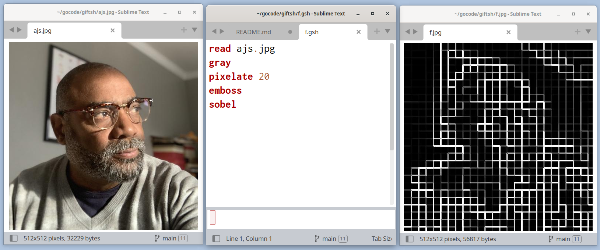

# giftsh -- a DSL and shell for editing images



gift is a little language (aka domain-specific language) for editing images.

commands are read one line at time (optional comments are skipped)
and image opertations are performed in order on the image.

For example, running giftsh:

```giftsh < test.gsh > f.jpg```

with this script in test.gsh

```
read ajs.jpg
gray
pixelate 20
emboss
sobel
```

reads an image, converts it to grayscale, pixelates it, and applies emboss and sobel filters. At the end of the script the result is written to ```f.jpg```.

By default giftsh reads commands from standard in, and writes results to standard out.
The -w option writes the result after each command.

## options

```
Usage of giftsh:
  -c filename (script file)
  -o filename (result file)
  -w filename (file to watch changes interactively)
  -h          (show command set)
```

if you specify -w, don't specify -o.

## command set

```
Command         Parameters
blur            value > 0
brightness      value (-100, 100)
colorbalance    red green blue (-100, 500)
colorize        hue (0-360) saturation (0-100) percentage (0-100)
colorspace      l for linear->sRGB or s for sRGB->linear
contrast        value (-100, 100)
crop            x1 y1 x2 y2 (rectangle at (x1,y1) and (x2,y2)
cropsize        width height
edge            edge filter
emboss          emboss filter
fliph           flip horizontal
flipv           flip vertical
gamma           value (< 1 darken, > 1 lighten)
gray            grayscale image
help            show command set
hue             value (-180, 180)
invert          invert image
max             local maximum size (odd positive integer)
mean            local mean size (odd positive integer)
median          local median size (odd positive integer)
min             local minimum size (odd positive integer)
opacity         value (0-100)
pixelate        pixels
read            imagefile (open source file)
reset           discard image edits (watch mode only)
resize          width height
resizefill      width height
resizefit       width height
rotate          degrees counter-clockwise
saturation      value (-100, 500)
sepia           value (0-100)
sigmoid         midpoint (0,1) factor (-10,10)
sobel           sobel filter
threshold       color threshold percentage (0-100)
transpose       flip horizontally and rotate 90° counter-clockwise
transverse      flip vertically and rotate 90° counter-clockwise
unsharp         sigma (> 0) amount (0.5, 1.5) threshold (0, 0.05)
```
